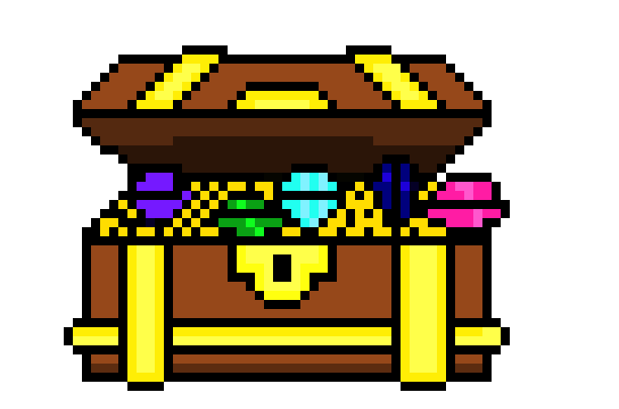
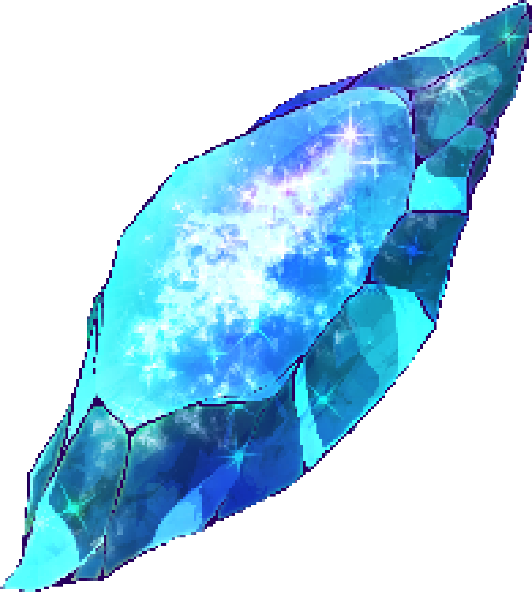
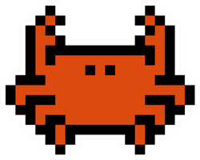
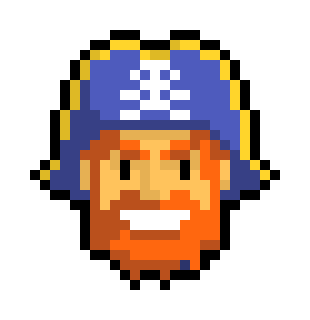

# Treasure Hunter

## Contexto
Eres un marinero que ha llegado a la isla de los tesoros, ¡rápido, agarra tu pala y empieza a cavar! Tienes dos tipos de objetos a recoger: tesoros y joyas, cada uno te dará una diferente puntuación. Su contraparte son los cangrejos, que, si bien no están interesados en ti, si pasas cerca de ellos te robarán tesoros, cuidado, te quitarán puntos. No estás solo en esta isla, hay piratas que no están muy felices de que les quites sus tesoros. Te están buscando, escóndete o huye, logra conseguir la mejor puntuación que puedas. ¡Diviértete!

## Objetivo
Conseguir un juego agradable, intuitivo y a la vez entretenido, algo simple y fácil de jugar para todos. La diversión que nos pueden generar los videojuegos no tiene por qué ser algo de solo ciertas edades, debería ser para cualquiera que quiera usar la computadora.

## Justificación
El videojuego "Treasure Hunter" fue desarrollado para cumplir con los requisitos del examen de Graficación 2D, utilizando la Canvas API para la implementación gráfica. El proyecto tiene como finalidad no solo proporcionar entretenimiento, sino también poner en práctica y demostrar los conocimientos adquiridos durante el curso.

La elección de este concepto se basó en la simplicidad de la mecánica y la posibilidad de incluir elementos visuales atractivos y dinámicos, lo cual hace que el juego sea accesible y divertido para un público amplio.

## Operación del videojuego
El juego "Treasure Hunter" es sencillo en su mecánica pero desafiante. El jugador controla a un marinero que debe recoger tesoros y joyas mientras evita cangrejos y piratas.

- *Controles*: Te mueves con el mouse.
- *Objetos*:
  - *Tesoros*: Dan puntos al ser recogidos.
    
  - *Joyas*: Otorgan menos puntos al ser recogidos.
    
  - *Cangrejos*: Restan puntos si el jugador pasa cerca de ellos.
    
  - *Piratas*: Persiguen al jugador y deben ser evitados.
    
  - *Barcos* Disparan hacia el jugador, evita sus balas
    
- *Objetivo del juego*: Obtener la mayor cantidad de puntos posible antes de ser atrapado por los piratas o las balas de cañón.

El juego cuenta con un sistema de puntuación que se muestra en la pantalla, permitiendo al jugador ver su progreso en tiempo real.

## Instrucciones claras
- *Inicio del juego*: Al cargar la página, el juego comienza automáticamente.
- *Movimientos*: Utiliza el ratón para moverte.
- *Recoger objetos*: Simplemente pasa sobre los tesoros y joyas para recogerlos.
- *Evitar enemigos*: Mantente alejado de los cangrejos, piratas y balas de cañón.
- *Reiniciar juego*: En caso de perder, presiona el botón "Volver a jugar" para reiniciar la partida.
-
